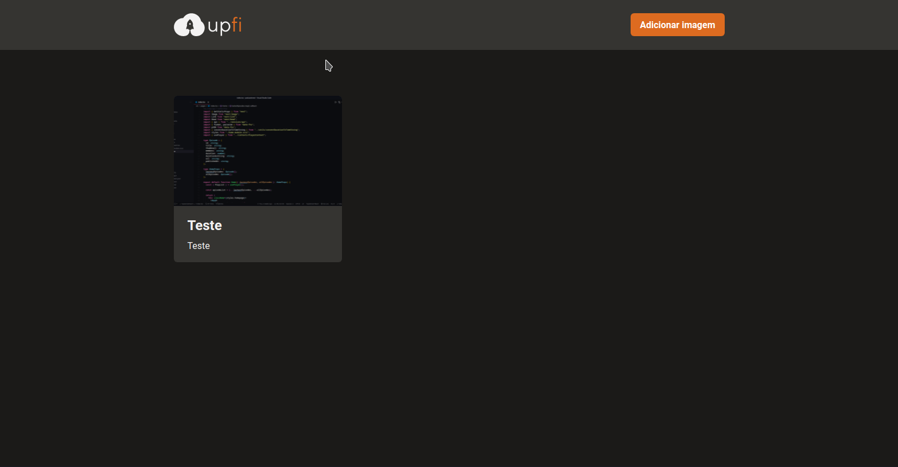
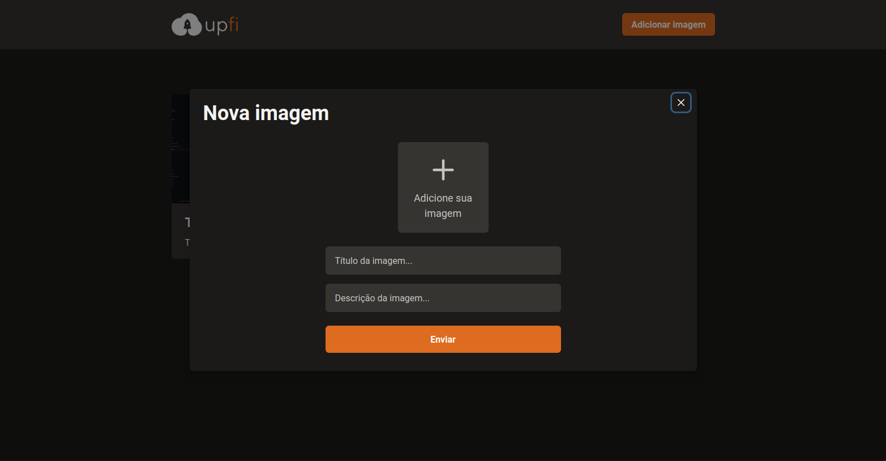
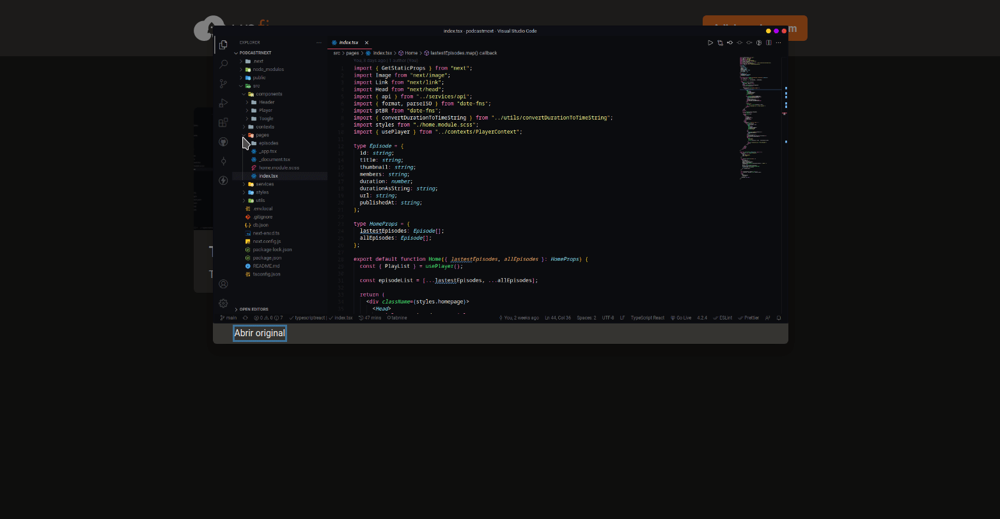

<h1 align="center">
  Upfi
  <br>
</h1>

<h4 align="center">Site com sistema de upload de imagens</h4>

<p align="center">
  <a href="#stack">Stack</a> •
  <a href="#features">Funções</a> •
  <a href="#how-to-use">Como usar</a> •
</p>

<p align="center">
  
  
  
</p>

## STACK

- Typescript
- Next.js
- FaunaDB
- imgDB
- Chakra UI
- React Query
- React Hook Form

## Funções

- Envio de imagens com teste na extensão do arquivo.
- Imagens armazenadas no faunaDb usando api do imgDb
- Listagem de imagens e scroll infinito

## Como usar

```bash
# Clone this repository
$ git clone https://github.com/Uallessonivo/reactjs-upload-de-imagens

# Go into the repository
$ cd reactjs-upload-de-imagens

# Install dependencies
$ yarn

# Run the app
$ yarn dev
```

Note: If you're using Linux Bash for Windows, [see this guide](https://www.howtogeek.com/261575/how-to-run-graphical-linux-desktop-applications-from-windows-10s-bash-shell/) or use `node` from the command prompt.

## License

MIT

---
